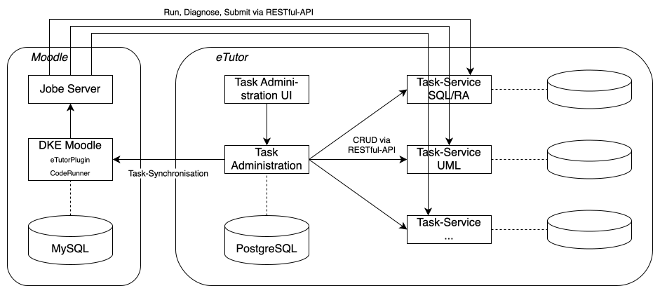

# eTutor

An interactice learning platform. The system comprises different services, below is a simple architecture diagram highlighting the connections of the different services, which can all be found in the respective repositories of this organization.

Detailed information on the services can be found in the corresponding repository.

## Documentation

You can find the documentation in the corresponding repositories. [Here](REPOS.md) you can find a short description of the repositories.

## Implementing a Task-App

There is a tutorial on how to implement a task-app and integrate it into the [Task-Administration UI](https://github.com/eTutor-plus-plus/task-administration-ui).

The sample implementation for a task-app can be found in the repository [Task-App Binary Search](https://github.com/eTutor-plus-plus/task-app-binary-search). This sample task-app was implemented in Java. However, it is also possible to develop the task app in any other programming language. The only requirement is that the task-app provides the RESTful interfaces specified [here](https://etutor-plus-plus.github.io/task-app-starter/api.html).

## Continuous Integration

Every service of the system is equipped with a CI-Pipeline based on Github Actions. 
The pipelines generically build the services and a Docker image containing the application, and push those images to the Docker Hub [repository](https://hub.docker.com/repositories/etutorplusplus). The pipelines are generally triggered by a push or a resolved pull request on the main branch of a service. Images are tagged according to the schema *etutorplusplus/repository:version*, where *repository* refers to the name of the respective services' repository, *version* to the branch and/or the released version and/or the Commit-Hash on which the image has been created.

As part of the pipeline, the generated jars will also be uploaded as artifacts and can be accessed by the respective workflow on Github.

The [deploy repository](https://github.com/eTutor-plus-plus/local-deploy) contains the docker-compose configuration to deploy the whole system based on the automatically created images for development (only available for internal users).

### Notes for Developers

Development on a service is best realized using the abovementioned deployment utility. This way you can easily deploy all services required, and test interactions of the service you are developing on with the whole system.
